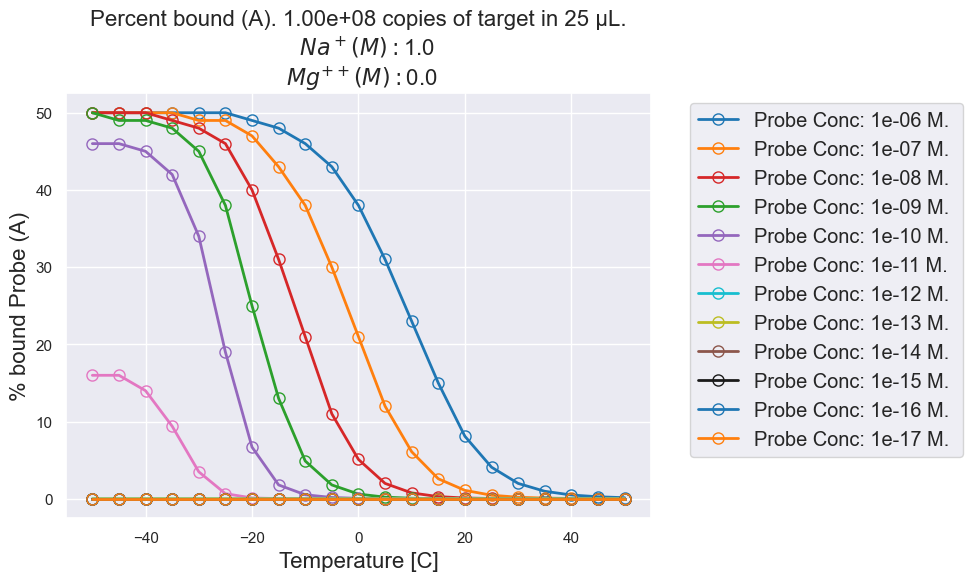

# Nupack-Analysis


<!-- ABOUT THE PROJECT -->

This repository is meant to be a guide for using python to run an analysis on Nupack.


<!-- TABLE OF CONTENTS -->
<details open="open">
  <summary>Table of Contents</summary>
  <ol>
    <li><a href="#project-overview">Project Overview</a></li>
    <li><a href="#getting-started">Getting Started</a></li>
    <li><a href="#dependencies">Dependencies</a></li>
    <li><a href="#contact">Contact</a></li>
  </ol>
</details>


<!-- ABOUT THE PROJECT -->
## Project Overview

nupack-4.0.0.26

Nupack documentation: https://piercelab-caltech.github.io/nupack-docs/analysis/


<!-- GETTING STARTED -->
## Getting Started


To get started, download or clone the repository. You can do this with by typing the following into terminal:


```sh
	git clone https://github.com/JoeHenthorn/Nupack-Analysis.git
	cd Nupack-Analysis
```

If you do not already have conda installed, do so now.
https://www.anaconda.com/download/

or 

```sh
	# install miniconda (if prefered)
	wget https://repo.anaconda.com/miniconda/Miniconda3-latest-Linux-x86_64.sh
	bash Miniconda3-latest-Linux-x86_64.sh
```

Once you have conda installed, type the following into terminal:
```sh
	conda env create --file dragNdropfileHere --name Nupack_environment
```

Replace dragNdropfileHere with a drag and dropped NupackENV.yml file.

Now, type into terminal the following command:

```sh
	conda activate Nupack_environment
```
Next type:
```sh
	jupyter notebook.
```

By this point you should be off to the races. Remember to navigate to the Nupack_Analysis.ipynb file inside your jupyter notebook to open the file.


## Dependencies
1. [Pandas](https://anaconda.org/anaconda/pandas)
	- Data-organization framework
2. [Numpy](https://anaconda.org/anaconda/numpy)
	- Numerical operations
3. [Matplotlib](https://anaconda.org/anaconda/matplotlib)
	- Data Visualization in python 
4. [Seaborn](https://anaconda.org/anaconda/seaborn)
	- High-level interface for attractive graphics
5. [datetime](https://anaconda.org/trentonoliphant/datetime)
	- Date and time library
6. [jupyter](https://jupyter.org/install)
	-Python notebook tool
6. [nupack](http://www.nupack.org/downloads)
	- DNA & RNA analysis tool


<!-- CONTACT -->
## Contact

- Joe Henthorn - JosefH1@uw.edu  GitHub: JoeHenthorn
