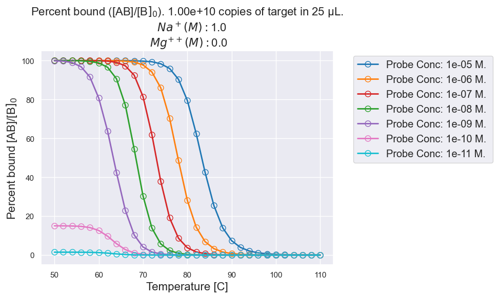

# Nupack-Analysis


<!-- ABOUT THE PROJECT -->

This repository is meant to be a guide for using python to run an analysis on Nupack.


<!-- TABLE OF CONTENTS -->
<details open="open">
  <summary>Table of Contents</summary>
  <ol>
    <li><a href="#project-overview">Project Overview</a></li>
    <li><a href="#getting-started">Getting Started</a></li>
    <li><a href="#dependencies">Dependencies</a></li>
    <li><a href="#contact">Contact</a></li>
  </ol>
</details>


<!-- ABOUT THE PROJECT -->
## Project Overview

nupack-4.0.0.26

Nupack documentation: https://piercelab-caltech.github.io/nupack-docs/analysis/


This python code will run a Nupack analysis, and will produce a percent bound graph for the input conditions. 

It is recommended to use the Nupack_Analysis_lite jupyter notebook for general purpose use.

Currently, the code only accepts a 5 prime strand and automatically generates a compliment strand. Future iterations of this code will allow for user specificed 3 prime strands.


To run the code, make sure everything is installed. With the jupyter notebook open, run all the import and function cells. Note: (shift+enter) runs cells:

The user interface cell should be labeled and will have the following input fields. 

- Five prime strand sequence

- Nucleic acid type: DNA or RNA 
 
- Temperature start in ˚C
- Temperature end in ˚C
- Temperature incriment

- Copy number of target/template in sample [Can be a list]

- Sample volume in μL [Can be a list]

- Sodium (Na+) molar concentration
- Magnesium (Mg++) molar concentration

Lastly, users can choose to save a figure by adding "save" as an argument.

Note: Users only need to fill out the variables and run the cell. For multiple analyses, just copy the cell, change the variables, and run the new analysis.


Note on future work: 
Future iterations of this code will incorperate list functionality for Na and Mg concetrations.

Future iterations of this code will incorperate more graphing options like 3D surface plots for multiple list inputs (e.g. list of copy numbers and ion concnetrations)

Future iterations of this code might offer a basic GUI depending on user feedback and demand.


<!-- GETTING STARTED -->
## Getting Started


To get started, download or clone the repository. You can do this with by typing the following into terminal:


```sh
	git clone https://github.com/JoeHenthorn/Nupack-Analysis.git
```
```sh
	cd Nupack-Analysis
```

If you do not already have conda installed, do so now.
https://www.anaconda.com/download/

or 

```sh
	# install miniconda (if prefered)
	wget https://repo.anaconda.com/miniconda/Miniconda3-latest-Linux-x86_64.sh
	bash Miniconda3-latest-Linux-x86_64.sh
```
Once you have anaconda installed, activate the conda envirnment with,

```sh
	conda activate ]
```


If you do not already have jupyter notebooks installed, do so now.
https://jupyter.org/install

or

```sh
	conda install -c conda-forge notebook
```


Once you have conda installed, you need to create the virtual environment with the correct packages to run the code. Type the following into terminal:

```sh
	conda env create -f NupackENV.yml
```
If this command fails for any reason, try the following,

```sh
	conda env create --file dragNdropfileHere --name Nupack_environment
```

Replace dragNdropfileHere with a drag and dropped NupackENV.yml file.

If you still cannot create the Nupack_environment, your conda packages might need updating. Try the command below, then retry the previous command.


```sh
	conda clean — packages && conda clean –all && conda update –all
```


Check that the environment was successfully created with the command below. You should see an output simular to "/Users/[You]/opt/anaconda3/envs/Nupack_Analysis"


```sh
	conda env list
```

Now, type into terminal the following command:

```sh
	conda activate Nupack_Analysis
```
Next type:
```sh
	jupyter notebook.
```

By this point you should be off to the races. Remember to navigate to the Nupack_Analysis.ipynb file inside your jupyter notebook to open the file.


## Dependencies
1. [Pandas](https://anaconda.org/anaconda/pandas)
	- Data-organization framework
2. [Numpy](https://anaconda.org/anaconda/numpy)
	- Numerical operations
3. [Matplotlib](https://anaconda.org/anaconda/matplotlib)
	- Data Visualization in python 
4. [Seaborn](https://anaconda.org/anaconda/seaborn)
	- High-level interface for attractive graphics
5. [Datetime](https://anaconda.org/trentonoliphant/datetime)
	- Date and time library
6. [Jupyter](https://jupyter.org/install)
	- Python notebook tool
6. [Nupack](http://www.nupack.org/downloads)
	- DNA & RNA analysis tool


<!-- CONTACT -->
## Contact

- Joe Henthorn - JosefH1@uw.edu  GitHub: JoeHenthorn
